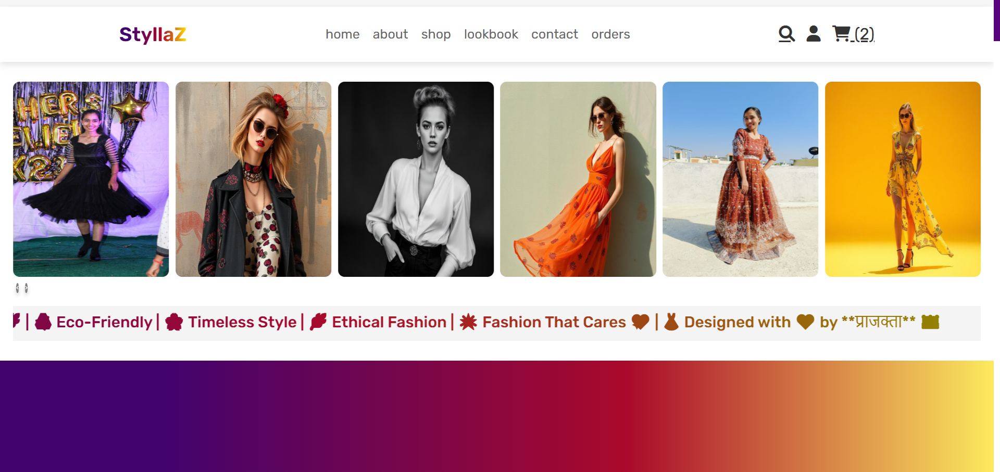
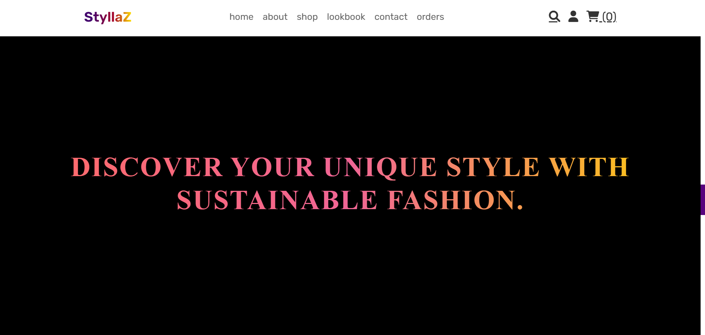
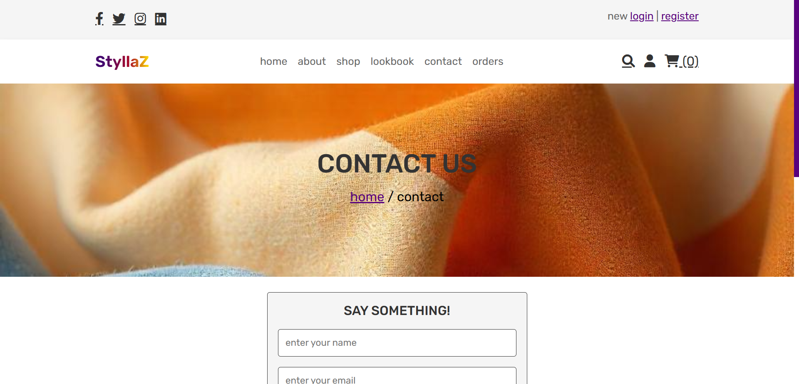
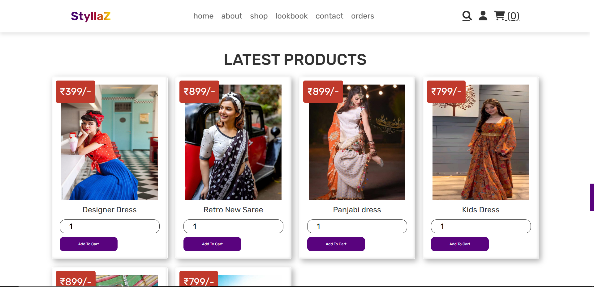
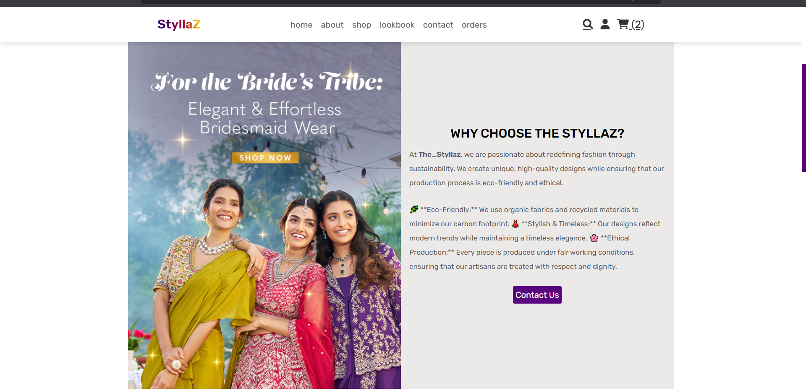
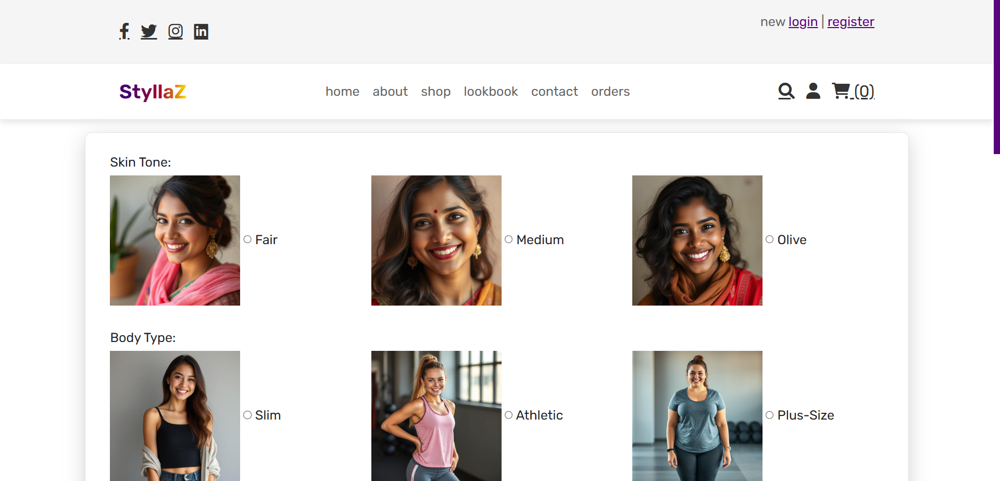

# Sustainable Fashion Marketplace 👗🌱

A full-stack e-commerce web application built using the MERN stack and Firebase. This project promotes sustainable fashion with features like user authentication, image uploads, and CRUD operations.

---

## 🔍 Features

- 🛍️ Product listing & filtering
- 🔐 Secure login/signup (Firebase Auth)
- 📸 Image uploads for products
- 🔄 CRUD functionality
- 📱 Responsive Design

---

## 🛠️ Tech Stack

- **Frontend:** ReactJS, Bootstrap
- **Backend:** NodeJS, ExpressJS
- **Database:** MongoDB (Cloud)
- **Auth & Hosting:** Firebase

---

## 📸 Project Screenshots

| Home Page | Product Upload |
|----------|----------------|
|  |  |

| Contact Page | Shop Page |
|----------|----------------|
|  |  |

| Lookup Page | Result Upload |
|----------|----------------|
|  |  |

---

## 🚫 Why Code Folder is Not Included?

This project is connected to a **live database** and includes API keys. For security reasons, the full source code is not publicly shared. If you're an interviewer or collaborator, feel free to contact me for a walkthrough.

---

## 📬 Contact

- 📧 patilprajakta2682003@gmail.com  
- 💼 [LinkedIn](https://www.linkedin.com/in/prajakta-patil-b3638222a/)  
- 🐱 [GitHub](https://github.com/praj268)
